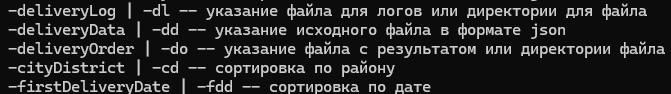

<h1>Тестовое задание</h1>

Данная программа работает с json файлами

В репозитории имеется тестовый файл для работы с программой

Логи хранятся в файле deliveryLog.log, который создается автоматически при перовм запуске программы

<h2>Функционал</h2>

Для вывода окна помощи нужно указать ключ -h

-deliveryLog | -dl -- указание файла для логов или директории для файла

-deliveryData | -dd -- указание исходного файла в формате json

-deliveryOrder | -do -- указание файла с результатом или директории файла

-cityDistrict | -cd -- указание района для сортировки

-firstDeliveryDate | -fdd -- указание даты или времени для сортировки